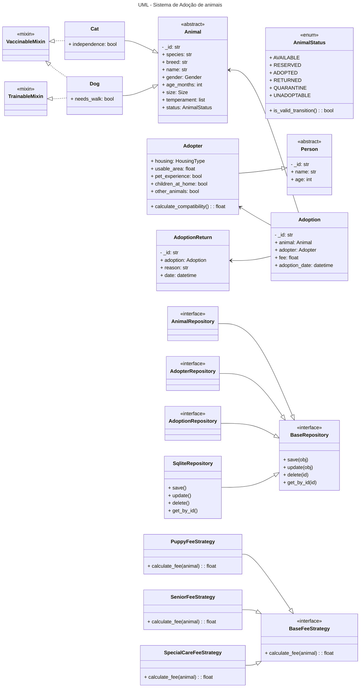

# Sistema de Adoção de Animais

**Instituição:** Universidade Federal do Cariri (UFCA)  
**Curso:** Engenharia de Software  
**Disciplina:** Programação Orientada a Objetos  
**Prof. Orientador:** Jayr Alencar Pereira  
**Aluno:** Gabriel Souza Santos  
**Semestre:** 2025.2  

Este repositório apresenta o desenvolvimento de um Sistema de Gerenciamento de Adoção de Animais, implementado em Python e fundamentado nos princípios da Programação Orientada a Objetos (POO). O projeto foi concebido com finalidade acadêmica e contempla a modelagem de domínio, aplicação de padrões de projeto, uso adequado de encapsulamento, herança e polimorfismo, além da elaboração de testes e adoção de boas práticas de engenharia de software.

---

##  Objetivos do Projeto

Este sistema foi projetado para:

- Modelar de forma clara as entidades centrais do processo de adoção.
- Aplicar princípios de **POO**, como encapsulamento, herança, polimorfismo e classes abstratas.
- Organizar o código em **camadas** (models, services, repositories, app).
- Definir uma fundação sólida baseada em padrões como:
  - **Repository Pattern**  
  - **Strategy Pattern** (para taxas de adoção)
  - **Mixins** (vacinação, adestramento)
- Usar um banco de dados leve e simples com **SQLite**.

O sistema é pensado para ser **extensível**, **testável** e fácil de manter.

---

## Estrutura Inicial do Projeto

```
sis-adocao-animais/
├── main.py
├── app/
│   ├── routes.py
│   ├── static/
│   └── templates/
├── models/
│   ├── adoption/
│   ├── animals/
│   ├── events/
│   └── people/
├── repositories/
│   ├── adopter_repo.py
│   ├── adoption_repo.py
│   ├── animal_repo.py
│   ├── base_repo.py
│   └── sqlite_repo.py
├── services/
│   ├── base_fee_strategy.py
│   └── fee_strategies.py
└── README.md
```

---

## Tecnologias Utilizadas

### **Python**
Linguagem principal usada para construir toda a lógica do sistema e sua arquitetura de classes.

### **Flask**
Framework planejado para a camada web (rotas, templates e requisições HTTP).

### **SQLite**
Banco de dados local simples, ideal para desenvolvimento e prototipação.

### **SQLAlchemy**
ORM utilizado para mapear classes Python para tabelas do banco e facilitar CRUD sem escrever SQL manual.

---

## Diagrama UML das Principais Classes

