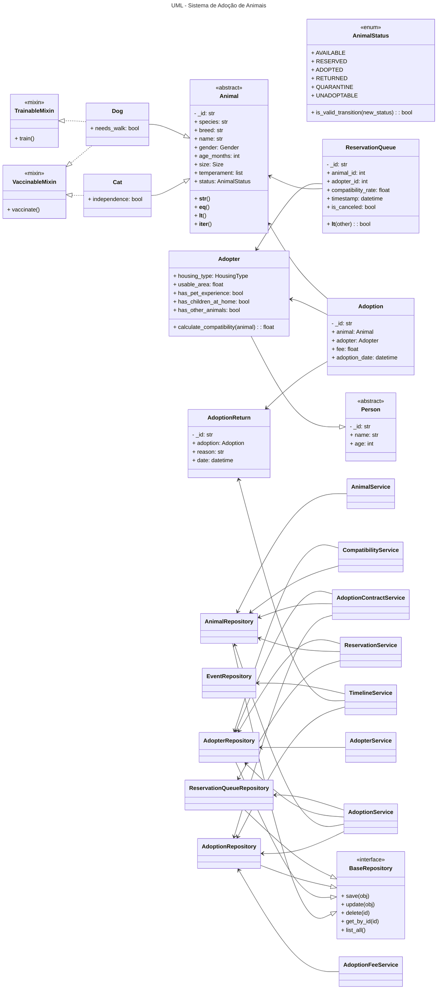

# Sistema de Adoção de Animais

## Informações Acadêmicas

**Instituição:** Universidade Federal do Cariri (UFCA)  
**Curso:** Engenharia de Software  
**Disciplina:** Programação Orientada a Objetos  
**Professor Orientador:** Jayr Alencar Pereira  
**Aluno:** Gabriel Souza Santos  
**Semestre:** 2025.2  

---

## Descrição do Projeto

Este repositório apresenta o desenvolvimento de um **Sistema de Gerenciamento de Adoção de Animais**, implementado em **Python** e fundamentado nos princípios da **Programação Orientada a Objetos (POO)**.

O projeto possui finalidade acadêmica e contempla:

- Modelagem de domínio
- Aplicação de princípios de POO
- Uso de padrões de projeto
- Elaboração de testes
- Adoção de boas práticas de Engenharia de Software

---

## Objetivos do Projeto

O sistema foi desenvolvido para:

- Modelar de forma clara e precisa as entidades centrais do processo de adoção
- Aplicar os princípios da Programação Orientada a Objetos:
  - Encapsulamento
  - Herança
  - Polimorfismo
  - Classes abstratas
- Organizar o código em camadas bem definidas
- Adotar padrões de projeto consolidados
- Trabalhar com banco de dados leve para prototipagem
- Construir um sistema extensível, testável e de fácil manutenção

---

## Arquitetura do Projeto

O projeto está organizado nas seguintes camadas:

- **Domain**
  - Entidades e regras de negócio
- **Services**
  - Lógica de aplicação
- **Infrastructure**
  - Persistência de dados e acesso ao banco
- **App**
  - Camada web com Flask (rotas, templates e front-end)
 
### Estrutura:
```
sis-adocao-animais/
│
├── app/
│   ├── __init__.py
│   ├── routes.py
│   ├── static/
│   │   └── styles.css
│   └── templates/
│       ...
│
├── domain/
│   ├── __init__.py
│   ├── exceptions.py
│   ├── adoptions/
│   │   ├── __init__.py
│   │   ├── adoption.py
│   │   ├── adoption_return.py
│   │   └── reservation_queue.py
│   ├── animals/
│   │   ├── __init__.py
│   │   ├── animal.py
│   │   ├── cat.py
│   │   └── dog.py
│   ├── enums/
│   │   ├── adopter_enums.py
│   │   ├── animal_enums.py
│   │   ├── animal_status.py
│   │   └── event_type.py
│   ├── events/
│   │   ├── __init__.py
│   │   ├── animal_events.py
│   │   └── event_converter.py
│   ├── mixins/
│   │   ├── trainable_mixin.py
│   │   └── vaccinable_mixin.py
│   └── people/
│       ├── __init__.py
│       ├── adopter.py
│       └── person.py
│
├── infrastructure/
│   ├── __init__.py
│   ├── database/
│   │   ├── database.db
│   │   └── db_connection.py
│   ├── db_models/
│   │   ├── __init__.py
│   │   ├── adopter_model.py
│   │   ├── adoption_model.py
│   │   ├── adoption_return_model.py
│   │   ├── animal_model.py
│   │   ├── event_model.py
│   │   └── reservation_queue_model.py
│   └── repositories/
│       ├── __init__.py
│       ├── adopter_repo.py
│       ├── adoption_repo.py
│       ├── adoption_return_repo.py
│       ├── animal_repo.py
│       ├── base_repo.py
│       ├── event_repo.py
│       └── reservation_queue_repo.py
│
├── services/
│   ├── __init__.py
│   ├── adopter_service.py
│   ├── adoption_contract_service.py
│   ├── adoption_fee_service.py
│   ├── adoption_service.py
│   ├── animal_service.py
│   ├── compatibility_service.py
│   ├── reservation_service.py
│   └── timeline_service.py
│
└── tests/
    ├── test_adopter.py
    ├── test_adoption.py
    ├── test_animal.py
    ├── test_base_repository.py
    ├── test_cat_and_dog.py
    ├── test_compatibility_service.py
    ├── test_person.py
    ├── test_reservation_queue.py
    └── test_reservation_service.py
```

---

## Funcionalidades Principais

### Gerenciamento de Animais
- Cadastro de animais
- Controle de status de adoção
- Registro de porte, idade e temperamento
- Uso de mixins para:
  - Vacinação
  - Adestramento

### Gestão de Adotantes
- Cadastro de informações pessoais
- Registro de tipo de moradia
- Experiência prévia com animais
- Convivência com crianças e outros pets

### Fila de Reservas
- Permite que adotantes reservem animais
- Cálculo automático de compatibilidade considerando:
  - Idade
  - Porte
  - Experiência do adotante
  - Temperamento do animal
  - Condições da residência
- Ordenação da fila por:
  - Índice de compatibilidade
  - Tempo de reserva
- Atualização automática do adotante elegível em caso de cancelamento

### Adoções e Contratos
- Registro de adoções efetivas
- Cálculo automático da taxa de adoção
- Geração de contrato de adoção:
  - Exibido no navegador
  - Disponível para download em formato `.txt`
- Registro de devoluções
- Histórico completo de adoções

---

## Tecnologias Utilizadas

- **Python** — linguagem principal
- **Flask** — criação de rotas, templates e controle de requisições HTTP
- **SQLite** — banco de dados leve e local
- **SQLAlchemy** — ORM para mapeamento objeto-relacional
- **Jinja2** — renderização de templates HTML

---

## Estrutura do Sistema

### 1. Domain
Contém todas as entidades e regras de negócio.

- Classes principais:
  - `Animal`
  - `Cat`
  - `Dog`
  - `Adopter`
  - `Adoption`
  - `ReservationQueue`
  - `AdoptionReturn`
- Mixins:
  - `VaccinableMixin`
  - `TrainableMixin`

### 2. Services
Camada responsável pela lógica de aplicação.

Principais serviços:
- `AdoptionService`
- `ReservationService`
- `CompatibilityService`
- `AdoptionContractService`
- `AdoptionFeeService`
- `TimelineService`

### 3. Infrastructure
Responsável pela persistência e acesso aos dados.

- Repositories (CRUD)
- Modelos SQLAlchemy (DB Models)

### 4. App
Camada web utilizando Flask.

Inclui:
- Rotas
- Templates Jinja2
- Visualização de:
  - Animais
  - Adotantes
  - Reservas
  - Adoções
  - Contratos
  - Relatórios e estatísticas

---

## Como Executar o Projeto

### 1. Criar e ativar o ambiente virtual

```bash
python -m venv .venv

source .venv/bin/activate   # Linux/Mac
.venv\Scripts\activate      # Windows
```
### 2. Instalar dependências:
```bash
pip install -r requirements.txt
```

### 3. Rodar aplicação:
```bash
python main.py
```

---

## Diagrama UML das Principais Classes


